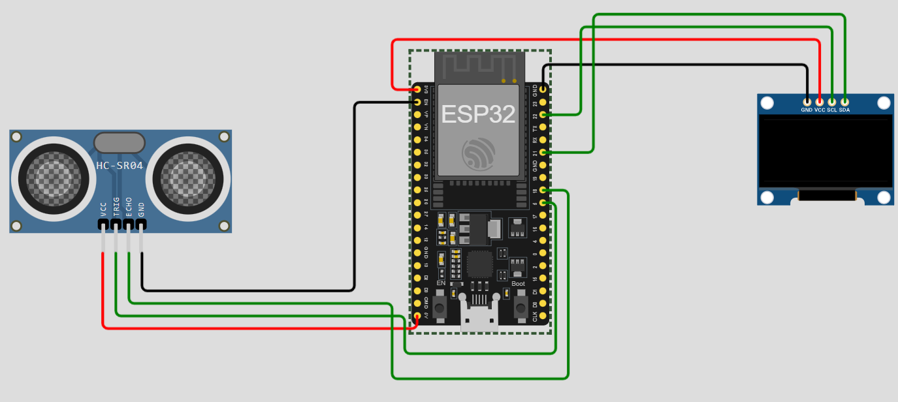

# ESP32-007-Gesture-Counter-with-ESP32✋
This project is a gesture-based counter using an ESP32, HC-SR04 Ultrasonic Sensor, and an OLED Display. Each time a gesture (hand movement within range) is detected, the ESP32 increments a counter and displays the value on the OLED.  A fun and interactive project that combines distance sensing with real-time counting!

---

## 🛠 Components Required

1. [ESP32 Development Board (30-pin)](https://robocraze.com/products/nodemcu-32-wifi-bluetooth-esp32-development-board30-pin?_pos=3&_psq=ESP32&_ss=e&_v=1.0)
2. [HC-SR04 Ultrasonic Sensor](https://robocraze.com/products/hc-sr-04-ultrasonic-sensor?_pos=2&_psq=HC&_ss=e&_v=1.0)
3. [1.3 inch OLED Display](https://robocraze.com/products/1-3in-oled-display?_pos=6&_psq=oled&_ss=e&_v=1.0)
4. [Breadboard](https://robocraze.com/products/breadboard?_pos=3&_psq=BREADBOARD&_ss=e&_v=1.0)
5. [Jumper Wires](https://robocraze.com/products/f2m-jumper-wires-20cm-40pcs?_pos=1&_psq=JUMPER+WIRES&_ss=e&_v=1.0)

---

## 🎥 Project Demo

* Instagram Reel 👉 [Watch Here](https://www.instagram.com/reel/DOBWmKDE8jk/?igsh=M2Ntb3B1MGRid3pn)

---
## Circuit Diagram

